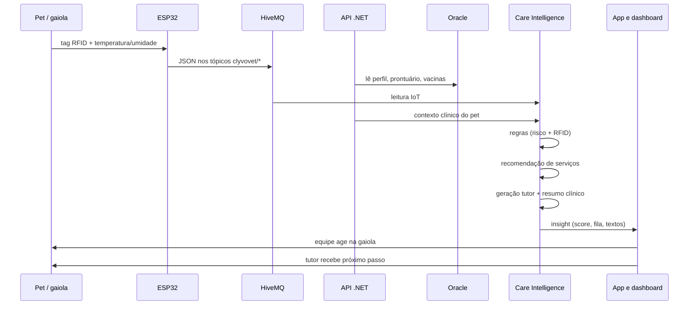
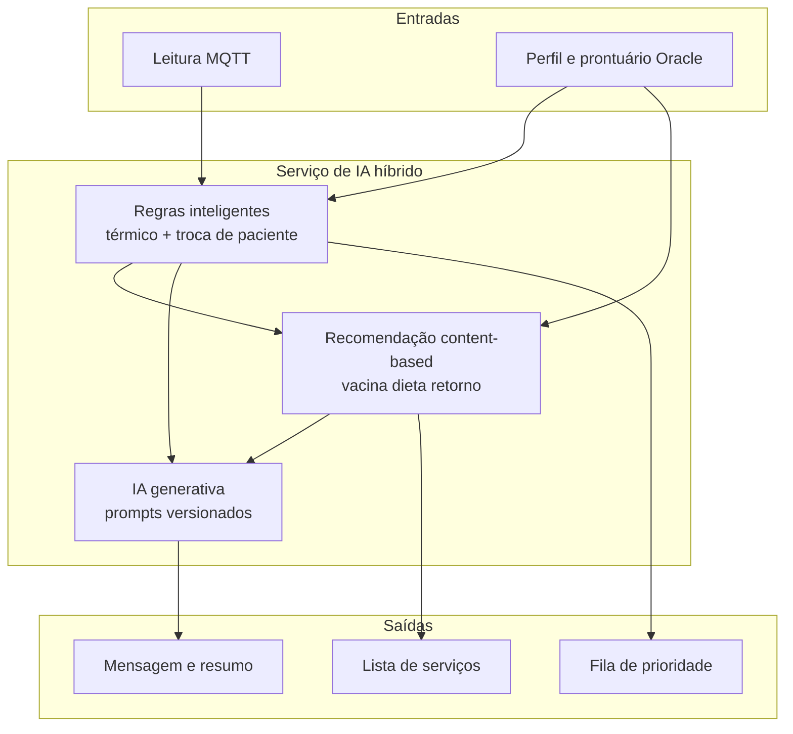

# Diagrama de arquitetura — CLYVO VET Care Intelligence

Comunicação entre usuários, aplicação, banco, APIs, IoT e componentes de IA.

## Visão de contexto

```mermaid
flowchart LR
    tutor[Tutor]
    equipe[Equipe da clínica]
    app[App / API Clyvo Vet<br/>.NET 10]
    oracle[(Oracle<br/>PET TUTOR CONSULTA<br/>PRONTUARIO VACINA)]
    esp[ESP32<br/>RFID + DHT22]
    mqtt[HiveMQ MQTT]
    nodered[Dashboard Node-RED]
    ia[Care Intelligence]
    regras[Motor de regras]
    rec[Recomendador]
    llm[Camada generativa / LLM]

    equipe --> app
    equipe --> nodered
    tutor --> app
    app --> oracle
    esp --> mqtt
    mqtt --> nodered
    mqtt --> ia
    app --> ia
    oracle --> ia
    ia --> regras
    ia --> rec
    ia --> llm
    rec --> ia
    regras --> ia
    llm --> ia
    ia --> app
    ia --> nodered
    app --> tutor
    app --> equipe
```

## Fluxo de dados (sequência)

## Onde cada componente de IA atua

## Integração com o que o grupo já entregou

| Bloco | Repositório / artefato | Papel agora |
|---|---|---|
| Hardware simulado | IoT-Challenge (Wokwi) | Origem dos eventos |
| Mensageria | HiveMQ `broker.hivemq.com` | Barramento IoT |
| Dashboard | Node-RED `flow_nodered.json` | Visualização humana da internação |
| Backend | ClyvoVet .NET + Oracle | Sistema de registro clínico |
| IA | este repositório | Decisão, personalização e linguagem |

O serviço de IA é **desacoplado**: consome JSON da API e JSON do MQTT. Não substitui a API e não substitui o dashboard; adiciona uma porta de insights.

## Protótipo desta pasta

Para a banca, o mesmo fluxo roda localmente:

`data/leituras_iot.json` + `data/base_clinica.json` → `python app.py` → fila, alertas, serviços e textos.

Em produção, troca-se o JSON estático pelas APIs reais e a função `ia_generativa` por uma chamada ao LLM com `prompts/sistema_tutor.txt` e `prompts/sistema_veterinario.txt`.
